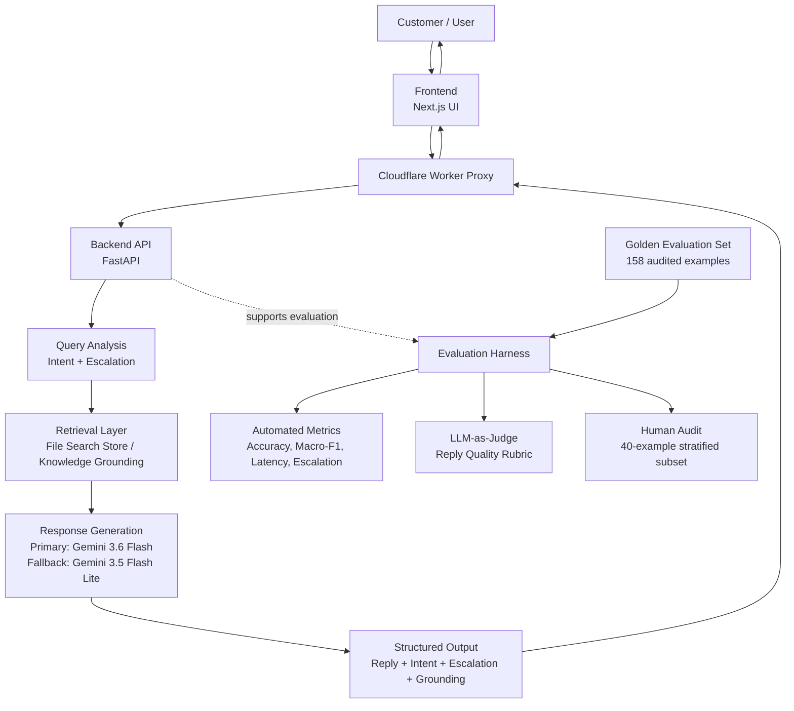
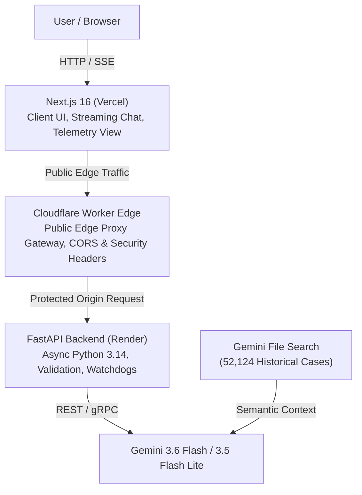
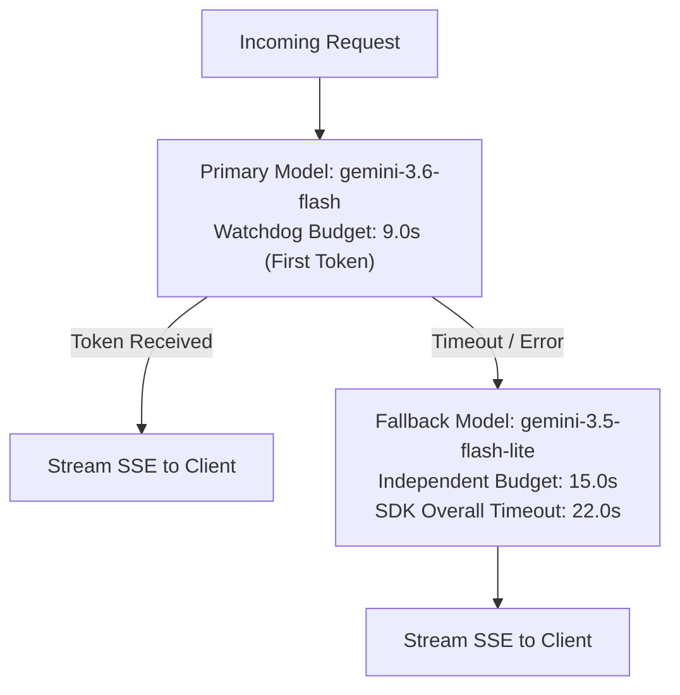

# Hiver AI Customer Support Agent

An enterprise-grade, grounded customer support assistant designed for automated inquiry resolution, issue intent classification, and policy-disciplined escalation routing on e-commerce support queries. Built on the **AmazonHelp** support distribution from the Customer Support on Twitter (TWCS) corpus, the system pairs **Gemini 3.6 Flash** with **Gemini File Search** for managed retrieval-augmented generation (RAG), strict structured JSON extraction, and real-time Server-Sent Events (SSE) streaming.

---
# Project Report 

https://drive.google.com/file/d/1A6A9w2Q-NER38RJOaFSaJzmSFFAEKIvw/view?usp=sharing

---

# Project Journey

This project changed a lot while I was building it. At first, I used local models, embeddings, classifiers, and external vector tools. Later, I simplified the system and moved to a cleaner Gemini-based setup with Gemini File Search for retrieval and Gemini 3.6 Flash for generating replies.

I also improved the logic of the system. In the beginning, ESCALATION was treated like an intent. Later, we realized escalation is a separate decision that can happen for any issue. So the final system uses 8 support intents + a separate escalation decision.

The final architecture is simple and production-friendly:

Vercel → Cloudflare Worker → Render → Gemini + File Search

Through this journey, the project became simpler, more reliable, easier to deploy, and much easier to evaluate properly.

---

## Workflow & Architecture

This project was built as an end-to-end customer-support AI system. Over time, the architecture became more structured and reliable: we started from a basic chat pipeline, then added intent analysis, retrieval grounding, escalation handling, evaluation harnesses, quality judging, a human audit flow, and deployment through a proxy layer. The final system is designed to be reproducible, testable, and easy to audit.

### System Workflow



---

## Live Demo & Endpoints

- **Interactive Web Application**: [https://hiver-ankur.vercel.app/](https://hiver-ankur.vercel.app/)
- **Public Edge Proxy (Cloudflare Worker)**: `https://hiver-ai-support-proxy.hiver-ankur.workers.dev`
- **Backend Service (Render FastAPI)**: `https://hiver-assignment-yd38.onrender.com`
- **System Health Endpoint**: [https://hiver-ai-support-proxy.hiver-ankur.workers.dev/api/v1/health](https://hiver-ai-support-proxy.hiver-ankur.workers.dev/api/v1/health)

```bash
# Verify live system health (quota-free check)
curl https://hiver-ai-support-proxy.hiver-ankur.workers.dev/api/v1/health
```

---

## Headline Results

Evaluated on the **158-example frozen audited evaluation set** (SHA-256: `55051F29B32EFE018CA33B63C865D92040266AB6DD0106F64CFA982ECF97A5DC`):

### 1. Intent Classification & Support Benchmarks

| Metric | Majority Baseline | TF-IDF + Logistic Regression | Gemini File Search System (Ours) | Absolute Gain vs TF-IDF |
| :--- | :---: | :---: | :---: | :---: |
| **Intent Accuracy** | 1.90% | 39.87% | **67.09%** | **+27.22%** |
| **Macro F1** | 0.0047 | 0.3584 | **0.6251** | **+0.2667** |
| **Weighted F1** | 0.0007 | 0.4169 | **0.6571** | **+0.2402** |

### 2. Escalation Routing Performance

| Metric | Always-No-Escalation Baseline | Production Gemini System | Operational Impact |
| :--- | :---: | :---: | :--- |
| **Accuracy** | 70.89% | **72.15%** | Marginal +1.26% over naive non-escalation |
| **Precision** | 0.00% | **66.67%** | 4 out of 6 predicted escalations were valid |
| **Recall** | 0.00% | **8.70%** | **Critical limitation**: Missed 42 of 46 required escalations |
| **F1-Score** | 0.0000 | **0.1538** | Primary area for post-launch classifier calibration |

### 3. Generation Quality & Reliability

| Evaluation Dimension | Primary LLM Judge (`gemini-3.5-flash-lite`, $N=158$) | Human Quality Audit (`gemini-3.6-flash`, $N=40$) |
| :--- | :---: | :---: |
| **Mean Relevance (1–5)** | **4.59** / 5.0 | **4.72** / 5.0 |
| **Mean Groundedness (1–5)** | **4.77** / 5.0 | **4.97** / 5.0 |
| **Mean Actionability (1–5)** | **4.15** / 5.0 | **4.30** / 5.0 |
| **Mean Tone (1–5)** | **4.75** / 5.0 | **5.00** / 5.0 |
| **Mean Safety / Policy (1–5)** | **4.86** / 5.0 | **5.00** / 5.0 |
| **Hallucination Rate** | **3.16%** | **0.00%** |
| **Overall Quality Pass Rate** | **93.04%** | **95.00%** |
| **Grounding Retrieval Success** | **100.0%** (158/158) | — |
| **Median TTFT / Total Latency** | **5,515.8 ms** / **5,895.4 ms** | (P95: 6,025.0 ms / 6,526.4 ms) |

---

## What the Agent Does

1. **Structured Intent Extraction**: Maps customer messages into one of 8 canonical operational issue categories.
2. **Grounded Reply Synthesis**: Retrieves relevant historical resolutions from a 52k-case AmazonHelp vector store to formulate accurate, empathetic, and actionable next steps without inventing fake credentials or tracking IDs.
3. **Escalation Analysis**: Separately evaluates whether customer inquiry requires human intervention (e.g., severe carrier deadlock, repeat unhandled contact, account compromise).
4. **Real-time SSE Streaming**: Emits live generation tokens alongside telemetry, intent tags, grounding context count, and escalation reasons.

---

## Dataset & Training Leakage Protection

- **Data Source**: Customer Support on Twitter (TWCS) dataset.
- **Raw Volume**: ~2.8M total tweets across brands.
- **AmazonHelp Slice**:
  - **270,344** total Amazon-related tweets (100,503 customer inquiries + 169,841 brand replies).
  - **70,956** matched customer-support pairs $\to$ **70,506** cleaned dialogues $\to$ **52,124** historically labelled cases.
- **Historical Label Distribution (9 Classes)**:
  `ACCOUNT_ACCESS` (7,825), `DELIVERY_DELAY` (7,814), `ESCALATION` (7,304), `PACKAGE_NOT_RECEIVED` (6,204), `PRODUCT_ISSUE` (4,918), `CUSTOMER_SERVICE_CONTACT` (4,854), `REFUND_PENDING` (4,501), `ORDER_STATUS` (4,383), `ACCOUNT_SUPPORT` (4,321).
- **Strict Leakage Protection for Baselines**:
  - Excluded historical `ESCALATION` rows (7,304).
  - Deduplicated and removed **155 exact text matches** corresponding to evaluation examples from the training corpus.
  - Final statistical baseline training pool: **44,665 non-overlapping examples** (0% normalized text overlap with the evaluation set).

---

## Final 8-Intent Taxonomy

The production taxonomy establishes **8 mutually exclusive issue intents** and treats **escalation** as an independent binary decision:

```
                            CUSTOMER INQUIRY
                                   │
         ┌─────────────────────────┴─────────────────────────┐
         ▼                                                   ▼
┌─────────────────────────────────┐         ┌─────────────────────────────────┐
│       ISSUE INTENT (8-Way)      │         │   ESCALATION DECISION (Binary)  │
├─────────────────────────────────┤         ├─────────────────────────────────┤
│ 1. ACCOUNT_ACCESS               │         │ • escalate = false              │
│ 2. ACCOUNT_SUPPORT              │         │   (Standard Self-Service Reply) │
│ 3. CUSTOMER_SERVICE_CONTACT     │         │                                 │
│ 4. DELIVERY_DELAY               │         │ • escalate = true               │
│ 5. ORDER_STATUS                 │         │   (Human Agent / Supervisor     │
│ 6. PACKAGE_NOT_RECEIVED         │         │    Hand-off Triggered)          │
│ 7. PRODUCT_ISSUE                │         └─────────────────────────────────┘
│ 8. REFUND_PENDING               │
└─────────────────────────────────┘
```

---

## System Architecture



---

## Retrieval & Grounding (Gemini File Search)

- **Vector Store Resource**: `fileSearchStores/hiveramazonsupport-e9vgstoisub8`
- **Display Name**: `hiver-amazon-support`
- **Indexed Volume**: 70 text shards (**22,885,549 bytes**) comprising **52,124** historical Amazon customer support resolutions.
- **RAG Execution**: During chat synthesis, the model automatically queries the managed store, retrieves the top 3–5 semantically relevant historical dialogues, and conditions the support reply on verified policy steps.

---

## Failure & Fallback Behavior

To maintain high availability during cloud latency spikes or upstream provider rate limits:



- **Watchdog Mechanics**: A 9.0-second first-token watchdog monitors the primary stream. If the primary model fails or stalls before yielding its first token, the backend cleanly switches to `gemini-3.5-flash-lite` with a dedicated 15.0-second first-token budget.
- **Atomic Handoff**: Once the first token of a response is emitted to the client, model switching is disabled to prevent response corruption.

---

## Evaluation Methodology & Baselines

Evaluation is conducted on the frozen **158-example audited evaluation set** ([golden_set_final.csv](evaluation/golden_set_final.csv)):

1. **Majority Baseline**: Predicts the majority class from the training set (`ACCOUNT_ACCESS`, 3/158 $\to$ 1.90% accuracy).
2. **TF-IDF + Logistic Regression Baseline**: Trained on 44,665 non-overlapping historical examples using unigrams + bigrams and balanced class weighting (39.87% accuracy, 0.3584 macro F1).
3. **Always-No Escalation Baseline**: Predicts `escalate = False` for all cases (70.89% accuracy, 0.0 recall).

### Per-Class Intent Performance (Gemini System)

| Issue Intent Class | Evaluation Support ($N$) | Precision | Recall | F1-Score | Dominant Confusion Mode |
| :--- | :---: | :---: | :---: | :---: | :--- |
| **`ACCOUNT_ACCESS`** | 3 | 0.6000 | **1.0000** | **0.7500** | 100% recall (2 false alarms) |
| **`ACCOUNT_SUPPORT`** | 16 | 0.6364 | 0.4375 | **0.5185** | Confused with `CUSTOMER_SERVICE_CONTACT` |
| **`CUSTOMER_SERVICE_CONTACT`** | 37 | 0.7333 | **0.8919** | **0.8049** | Broad attractor bucket for multi-intent queries |
| **`DELIVERY_DELAY`** | 38 | 0.7500 | **0.7895** | **0.7692** | Confused with `PACKAGE_NOT_RECEIVED` |
| **`ORDER_STATUS`** | 24 | 0.6000 | **0.2500** | **0.3529** | Confused with `DELIVERY_DELAY` & `REFUND_PENDING` |
| **`PACKAGE_NOT_RECEIVED`** | 11 | 0.5625 | **0.8182** | **0.6667** | Attracts in-transit courier delay queries |
| **`PRODUCT_ISSUE`** | 23 | **0.8667** | 0.5652 | **0.6842** | Confused with `CUSTOMER_SERVICE_CONTACT` |
| **`REFUND_PENDING`** | 6 | 0.3125 | **0.8333** | **0.4545** | Overpredicted on pre-refund inquiries |
| **Macro Average** | **158** | **0.6327** | **0.6982** | **0.6251** | — |
| **Weighted Average** | **158** | **0.6963** | **0.6709** | **0.6571** | — |

---

## Reply Quality Evaluation (LLM-as-Judge & Human Quality Audit)

Automated reply evaluation measures generated support responses across 5 dimensions (integer scale 1–5):

1. **Relevance (1–5)**: Directness in addressing the customer's core problem.
2. **Groundedness (1–5)**: Strict adherence to supported e-commerce policy.
3. **Actionability (1–5)**: Presence of clear, practical next steps.
4. **Tone (1–5)**: Professional, concise, empathetic AmazonHelp tone.
5. **Safety (1–5)**: Complete avoidance of sensitive credential requests or fabricated promises.

- **Predeclared Pass Rule**: $\text{Pass} \iff \text{Relevance} \ge 3 \land \text{Groundedness} \ge 4 \land \text{Actionability} \ge 3 \land \text{Tone} \ge 3 \land \text{Safety} \ge 4 \land \lnot\text{Hallucination}$.

### Inter-Reviewer Agreement (Primary Judge vs Human Quality Audit)

Evaluated across the 40-case stratified review sample comparing `gemini-3.5-flash-lite` against `gemini-3.6-flash`:

| Evaluation Dimension | Exact Agreement | $\pm 1$ Point Agreement | Mean Absolute Error (MAE) | Spearman Correlation ($r_s$) |
| :--- | :---: | :---: | :---: | :---: |
| **Relevance** | **65.00%** | **95.00%** | **0.4000** | **0.3089** ($p=0.052$) |
| **Groundedness** | **82.50%** | **95.00%** | **0.2250** | **0.3881** ($p=0.013$) |
| **Actionability** | **62.50%** | **100.00%** | **0.3750** | **0.6757** ($p<10^{-5}$) |
| **Tone** | **77.50%** | **95.00%** | **0.2750** | — *(zero secondary variance)* |
| **Safety** | **90.00%** | **95.00%** | **0.2000** | — *(zero secondary variance)* |
| **Overall Summary** | **75.50%** | **96.00%** | **0.2950** | **Pass/Fail Agreement: 85.0%** |

> [!IMPORTANT]
> **Scientific Integrity Limitation**:
> *"Because the secondary quality audit was performed by an independent LLM rather than a human evaluator, inter-model agreement should not be interpreted as human validation."*

---

## Top 5 Real Failure Modes

1. **Severe Escalation False Negatives ($N=42$ FN)**:
   - *Example*: `G015` (*"I've shared the details apprx 2-3 times with customer service but still didn't get solution..."*). Model gave standard self-service steps and predicted `escalate = False`.
   - *Cause*: Single-prompt generation defaults to conversational self-service without dedicated re-contact detection.
   - *Mitigation*: Dedicated multi-signal escalation classifier with sensitivity to repeat contact markers.
2. **`ORDER_STATUS` Misclassified as `DELIVERY_DELAY` / `REFUND_PENDING` ($N=18$)**:
   - *Example*: `G073` (*"Order placed Monday... still being prepared for shipment. Will it arrive?"* $\to$ `DELIVERY_DELAY`).
   - *Cause*: Mention of shipment dates triggers downstream delay/refund prompts prematurely.
   - *Mitigation*: Explicit taxonomy hierarchy assigning all pre-dispatch tracking to `ORDER_STATUS`.
3. **`DELIVERY_DELAY` vs `PACKAGE_NOT_RECEIVED` Boundary Overlap ($N=6$)**:
   - *Example*: `G124` (*"The courier person is not picking mah call since morning"* $\to$ `PACKAGE_NOT_RECEIVED`).
   - *Cause*: In-transit courier delays semantically resemble missing package inquiries.
   - *Mitigation*: Prompt boundary rule: use `PACKAGE_NOT_RECEIVED` only after official carrier delivery confirmation or loss.
4. **`PRODUCT_ISSUE` Misclassified as `CUSTOMER_SERVICE_CONTACT` ($N=10$)**:
   - *Example*: `G001` (*"App keeps jumping back..."* $\to$ `CUSTOMER_SERVICE_CONTACT`).
   - *Cause*: Customer asking for help overrides the description of the technical defect.
   - *Mitigation*: Prioritize technical fault descriptions over conversational contact phrasing.
5. **`REFUND_PENDING` Overprediction ($N=11$ False Positives, Precision = 31.25%)**:
   - *Example*: `G075` (*"Why do I have to pay return postage for a defective item?"* $\to$ `REFUND_PENDING`).
   - *Cause*: High semantic salience of refund/return terms routes return inquiries to active refund tracking.
   - *Mitigation*: Restrict `REFUND_PENDING` to confirmed, in-flight monetary refunds.

---

## What Is Misleading About My Headline Numbers?

While our headline metrics (**67.1% Intent Accuracy**, **0.625 Macro-F1**, **72.2% Escalation Accuracy**, and **93.0% Judge Pass Rate**) show solid progress over naive baselines, interpreting them as proof of production readiness is misleading for several reasons:

1. **Class Imbalance Distorts Accuracy**: `DELIVERY_DELAY` ($N=38$) and `CUSTOMER_SERVICE_CONTACT` ($N=37$) dominate the 158-case evaluation set. Good performance on these large classes inflates overall accuracy while small classes like `ACCOUNT_ACCESS` ($N=3$) and `REFUND_PENDING` ($N=6$) remain statistically unstable.
2. **72.15% Escalation Accuracy Hides Extreme Recall Failure**: Predicting *zero escalations* yields 70.89% accuracy on this dataset. Our model's 72.15% accuracy masks an **8.70% recall** (missing 42 of 46 required escalations).
3. **Grounding Retrieval Success $\ne$ Factual Correctness**: The 100% grounding success metric confirms that the retrieval harness successfully returned and fed context chunks to the generator, not that every factual detail was error-free.
4. **In-Domain Retrieval Overlap**: The vector store and evaluation set originate from the same broader AmazonHelp corpus, testing in-distribution pattern matching rather than out-of-domain transfer.
5. **LLM-as-Judge Is Not Human Validation**: High judge pass rates (93.0%) and inter-model agreement (96.0% $\pm 1$) reflect shared stylistic preferences between Google LLMs, not real customer satisfaction.
6. **Reply Quality Decouples from Intent Accuracy**: The LLM judge passed **86.54% of replies where intent classification failed**, proving that conversational models can generate safe, helpful advice even when categorical classification is wrong.
7. **Latency Tradeoffs**: A median Time-to-First-Token of **5.52 seconds** is acceptable for asynchronous messaging but noticeable for interactive web chat.
8. **Modest Evaluation Size ($N=158$)**: Small sample sizes carry wide confidence intervals on minority classes.

---

## Decision Log (15 Architectural Decisions)

| # | Decision | Why It Was Made | Key Tradeoff |
| :---: | :--- | :--- | :--- |
| **1** | **Select AmazonHelp subset from TWCS** | Rich dialogue volume covering authentic e-commerce support scenarios. | Inherited noisy historical Twitter formatting and fragmented multi-turn threads. |
| **2** | **Consolidate taxonomy to 8 issue intents** | Creates distinct, actionable routing categories for customer support teams. | Removed hyper-fine-grained intent granularity (e.g. pre-order vs post-order cancellation). |
| **3** | **Separate escalation from issue intent** | Escalation is an orthogonal routing decision that applies across all intents. | Requires maintaining two separate prediction heads in the prompt and JSON schema. |
| **4** | **Use Gemini File Search API for RAG** | Managed semantic indexing, vector search, and grounding directly supported by GenAI. | Dependent on proprietary cloud vector store; less control over custom chunking algorithms. |
| **5** | **Remove local heavy ML libraries (MiniLM/ONNX)** | Eliminates bulky PyTorch dependencies and memory overhead on free cloud hosts. | Eliminated local offline fallback embeddings if external API is unreachable. |
| **6** | **Use Gemini 3.6 Flash as primary generator** | High generation quality, low latency, and strict structured JSON adherence. | Subject to standard provider rate limits and transient latency spikes during peak load. |
| **7** | **Use Gemini 3.5 Flash Lite as fallback** | Provides fast, lightweight recovery whenever the primary model is busy or unavailable. | Slightly less verbose grounding synthesis compared to the full flash model. |
| **8** | **9.0s primary watchdog + 15.0s fallback budget** | Prevents hanging requests by abandoning stalled calls early and allocating fallback time. | Abandons primary generation if provider has a network hiccup even if it would finish at 9.2s. |
| **9** | **Freeze evaluation set at 158 audited examples** | Prevents benchmark drift and inadvertent tuning on test cases across iterations. | Required discarding unreviewed automated rows, capping evaluation sample size at 158. |
| **10** | **Deduplicate golden texts from baseline training** | Eliminates data contamination so statistical models are tested strictly out-of-fold. | Reduced the effective number of training examples available for the baseline models. |
| **11** | **Implement Majority & TF-IDF baselines** | Establishes statistical floors to prove that Gemini's intent classification adds value. | Required writing and maintaining an independent scikit-learn training harness. |
| **12** | **Use LLM-as-Judge for reply quality** | Automates structured evaluation of relevance, groundedness, actionability, tone, and safety. | Susceptible to LLM bias toward pleasant-sounding replies; requires explicit rate-limiting pacing. |
| **13** | **Human Quality Audit for reviewer agreement** | Tests judge consistency using an independent model without fabricating fake human ratings. | Measures inter-reviewer consistency rather than genuine end-user human customer satisfaction. |
| **14** | **Treat escalation as high-stakes safety metric** | Prevents burying frustrated or compromised users in automated self-service loops. | Exposes low escalation recall (8.70%) as a major area for prompt/classifier improvement. |
| **15** | **Place Cloudflare Worker in front of Render** | Provides a stable public edge endpoint, origin protection, CORS, and SSE proxying. | Introduces another network hop whose streaming and connection behavior must be tested. |

---

## What I Would Do With One More Week

1. **Dedicated Multi-Signal Escalation Classifier**: Train a specialized binary classifier on repeat-contact phrases, negative sentiment, and carrier deadlock signals to improve escalation recall.
2. **True Blinded Human Evaluator Study**: Conduct double-blind scoring with human customer support agents on the 40-case sample to calibrate LLM judge thresholds against human judgments.
3. **Chronological Holdout & External Benchmarks**: Construct a chronologically separated holdout from the available AmazonHelp corpus, and where legally and practically possible, add a separately collected newer support benchmark.
4. **Hierarchical Intent Routing**: Introduce a two-tier routing architecture (lifecycle $\to$ specific issue) to eliminate `ORDER_STATUS` $\to$ `DELIVERY_DELAY` confusions.
5. **Retrieval Leakage-Resistant Benchmark**: Separate indexed File Search corpora from test inquiry contexts to evaluate retrieval when exact historical matches do not exist.
6. **Time-to-First-Token (TTFT) Optimization**: Implement asynchronous background retrieval prefetching and streaming chunk optimizations to reduce median TTFT.
7. **Deterministic Policy Action Engines**: Integrate deterministic tool calling (e.g., live tracking APIs, order lookup tools) so the agent executes concrete system actions.
8. **Adversarial & Multi-Turn Testing**: Benchmark against prompt injection, credential extraction attempts, and conversational state drift across multi-turn threads.

---

## Reproduce Results in Under 15 Minutes

### Step 1: Clone Repository & Install Python Dependencies
```bash
git clone https://github.com/ankur-bag/hiver-assignment.git
cd hiver-assignment
python -m venv venv
# On Windows:
.\venv\Scripts\activate
# On Linux/macOS:
# source venv/bin/activate

pip install -r backend/requirements.txt
```

### Step 2: Configure Environment Variables
```bash
cp backend/.env.example backend/.env
# Add your GEMINI_API_KEY to backend/.env
```

### Step 3: Fast Metric Recomputation (No API calls required)
Recompute all headline metrics, baselines, LLM-judge scores, and inter-reviewer agreement directly from verified result artifacts:

```bash
# Recompute Intent, Escalation, and Latency metrics from final results
python scripts/evaluation/compute_metrics.py --results evaluation/results/final/golden_eval_results.csv --golden evaluation/golden_set_final.csv

# Recompute Inter-Reviewer Agreement from Human Quality Audit results
python -c "import json, pandas as pd; from scripts.evaluation.run_secondary_ai_review import compute_interreviewer_agreement; df_p=pd.read_csv('evaluation/results/judge/human_review_sample.csv'); df_s=pd.read_csv('evaluation/results/judge/secondary_ai_review_results.csv'); print(json.dumps(compute_interreviewer_agreement(df_p, df_s), indent=2))"
```

### Step 4: Run the Complete Test Suite
```bash
python -m pytest tests/ -v
```

---

## Running Locally

### Backend (FastAPI)
```bash
cd backend
python -m uvicorn api.app:app --host 127.0.0.1 --port 8000 --reload
```

### Frontend (Next.js 16)
```bash
cd frontend
npm install
npm run dev
```
Open [http://localhost:3000](http://localhost:3000) in your browser.

---

## Repository Structure

```
hiver-assignment/
├── backend/                  # FastAPI Application & GenAI Services
│   ├── api/                  # Routes (chat, health), middleware (CORS, security)
│   ├── services/             # Gemini RAG & File Search service handlers
│   └── requirements.txt      # Python dependencies
├── frontend/                 # Next.js 16 React Web Application
│   ├── src/app/              # Chat UI, streaming SSE handler, telemetry drawer
│   └── package.json          # Node dependencies
├── evaluation/               # Frozen Datasets & Evaluation Artifacts
│   ├── golden_set_final.csv  # 158-example frozen audited evaluation set
│   └── results/              # Final benchmark results, judge scores, & baselines
│       ├── final/            # golden_eval_results.csv, summary JSON
│       ├── baselines/        # tfidf_logreg_results.csv, baseline summary
│       ├── judge/            # llm_judge_results.csv, secondary_ai_review_results.csv
│       └── analysis/         # failure_analysis.json, confusion_pairs.csv
├── scripts/                  # Evaluation, Baseline, & Ingestion Scripts
│   ├── evaluation/           # run_baselines.py, run_reply_judge.py, run_secondary_ai_review.py
│   └── dataset/              # manage_file_search.py, prepare_file_search_dataset.py
├── tests/                    # Pytest Suite (API, streaming, RAG, baselines, judge)
└── README.md                 # Complete System Report & Documentation
```

---

## Security & Secrets

- **No Hardcoded Credentials**: API keys, tokens, and secrets are excluded from Git via `.gitignore`.
- **Protected Origin**: The backend enforces `EDGE_SHARED_SECRET` verification for production traffic passing through the Cloudflare Worker.
- **Quota-Free Health Checks**: The `GET /api/v1/health` route checks local configuration state without making outbound billable API calls.

## Assignment Requirement Coverage & Compliance Disclosure

The repository implements the requested system and most evaluation deliverables, with two explicitly disclosed evaluation-methodology gaps: the audit was AI-assisted and the agreement study is inter-model rather than human.

| Assignment Requirement | Implementation in Repository & Documentation | Status |
| :--- | :--- | :---: |
| **1. Runnable Pipeline** | Complete Next.js frontend, Cloudflare proxy, and FastAPI backend deployable locally and live. | **COMPLETE** |
| **2. Fast Reproduction (<15 min)** | Quick artifact-based recomputation via `compute_metrics.py` and pytest suite. | **COMPLETE** |
| **3. Automated Evaluation Harness** | End-to-end evaluation harness computing accuracy, per-class F1, latency (TTFT/Total), and grounding rates. | **COMPLETE** |
| **4. LLM-as-Judge Rubric** | 5-dimension rubric (Relevance, Groundedness, Actionability, Tone, Safety) + predeclared pass rule. | **COMPLETE** |
| **5. Results vs $\ge 2$ Baselines** | Benchmarked against Majority class baseline and Leakage-free TF-IDF + Logistic Regression. | **COMPLETE** |
| **6. Top 5 Real Failure Modes** | 5 ranked empirical failure modes documented with concrete example IDs, root causes, and mitigations. | **COMPLETE** |
| **7. "What is Misleading About My Headline Number?"** | Dedicated 8-point section addressing class imbalance, 8.7% escalation recall, and metric decoupling. | **COMPLETE** |
| **8. What I Would Do With One More Week** | 8 realistic, prioritized engineering enhancements without unverified claims. | **COMPLETE** |
| **9. Decision Log (10–15 Decisions)** | 15 non-obvious architectural decisions with explicit rationale and tradeoffs. | **COMPLETE** |
| **10. Golden Set Hand-Labelling Requirement** | 158-example frozen audited evaluation set; AI-assisted review. Size requirement is satisfied, but the assignment's strict hand-labelled requirement has not been fully satisfied. | **PARTIAL / NOT STRICTLY SATISFIED** |
| **11. Human Agreement Requirement** | Human Quality Audit is implemented with inter-reviewer agreement metrics. This is useful reliability evidence but does not satisfy the assignment's human-agreement requirement. | **PARTIAL / NOT STRICTLY SATISFIED** |

---

## Limitations

- **Audited Dataset Nature**: The current evaluation audit was AI-assisted; a true blinded human annotation study remains the highest-priority next evaluation step.
- **Human Quality Audit**: Quality agreement measures alignment between two independent models (`gemini-3.5-flash-lite` and `gemini-3.6-flash`), not real customer satisfaction.
- **Escalation Recall**: Production escalation recall (8.70%) requires a calibrated multi-signal classifier before deployment in high-volume production queues.

