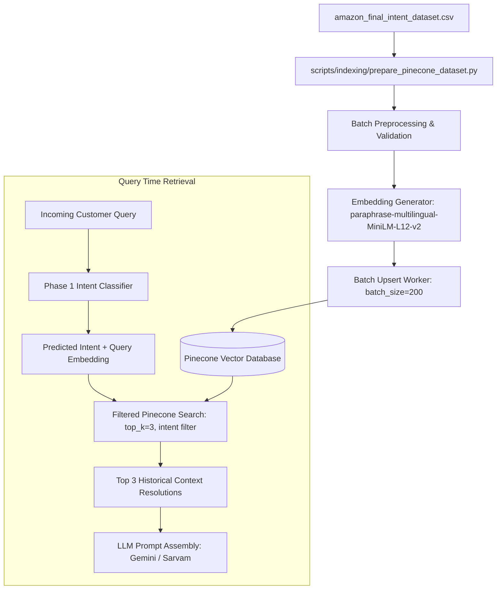

# Phase 2 Architecture Blueprint: Pinecone Vector Database Construction

## 1. Overview & Objective

The goal of Phase 2 is to construct a production-ready vector retrieval index using **Pinecone (Serverless / Free Tier)** to enable high-accuracy semantic search over historical customer support conversations.

When a customer submits an inquiry, our agent will:
1. Classify the customer's intent using the **Phase 1 ML Pipeline** (`backend/ml/`).
2. Generate an embedding vector of the customer's query using `paraphrase-multilingual-MiniLM-L12-v2`.
3. Perform a filtered vector search in Pinecone using the predicted `intent` metadata filter.
4. Retrieve the top-$K$ most semantically relevant historical resolution pairs (`customer_text`, `amazon_reply`, `intent`).
5. Feed the retrieved context to Gemini / Sarvam LLM for grounded, brand-consistent generation.

---

## 2. Vector Index Specifications

| Parameter | Specification | Rationale |
| :--- | :--- | :--- |
| **Vector Database** | Pinecone Serverless | Zero operational overhead, native metadata filtering, high QPS. |
| **Index Name** | `amazon-support-resolutions` | Namespaced for customer support domain. |
| **Dimension** | `384` | Exact output dimension of `paraphrase-multilingual-MiniLM-L12-v2`. |
| **Metric** | `Cosine` | L2-normalized vectors allow cosine similarity via dot product. |
| **Cloud Provider / Region** | `aws` / `us-east-1` | Free tier default for lowest latency with major serverless platforms. |

---

## 3. Data Schema & Metadata Mapping

Each historical conversation from `amazon_final_intent_dataset.csv` is mapped into a vector record:

```json
{
  "id": "conv_48291",
  "values": [0.0382, -0.0194, 0.0821, "... 384 dimensions"],
  "metadata": {
    "intent": "PACKAGE_NOT_RECEIVED",
    "customer_text": "My package was marked delivered but I have not received it.",
    "amazon_reply": "We are sorry to hear that! Please verify the shipping address on your order details and check with neighbors. If still missing, click here: https://amazon.com/help",
    "cluster_id": 8,
    "language": "en"
  }
}
```

### Metadata Fields

- `intent` (String, Indexed): Canonical intent label (`PACKAGE_NOT_RECEIVED`, `REFUND_PENDING`, etc.). Enables hard-filtering in queries: `filter={"intent": {"$eq": "PACKAGE_NOT_RECEIVED"}}`.
- `customer_text` (String, Non-indexed storage): The cleaned customer inquiry text.
- `amazon_reply` (String, Non-indexed storage): The verified brand response from Amazon customer service.
- `cluster_id` (Integer): The semantic cluster ID from exploratory clustering.
- `language` (String): Detected/inferred query language (`en`, `hi`, `es`, `de`, `fr`).

---

## 4. Ingestion Pipeline Architecture



### Batch Ingestion Strategy
- **Corpus Size:** ~52,124 historical pairs.
- **Batch Chunking:** Batches of 200 records per upsert to adhere to Pinecone payload limits (< 2MB per request).
- **Rate-limit Protection:** Exponential backoff with jitter on HTTP 429 / connection timeouts.
- **Deduplication:** Hashed customer queries (`sha256(customer_text)[:16]`) used as deterministic IDs to allow idempotent reruns.

---

## 5. Security & Secret Management

- `PINECONE_API_KEY`: Stored exclusively in `backend/.env`.
- `PINECONE_ENVIRONMENT`: Stored in `backend/.env`.
- No raw keys committed to Git or pushed to remote repositories.

---

## 6. Implementation Checklist for Phase 2

1. [ ] Install Pinecone client: `pip install pinecone` (or `pinecone-client`).
2. [ ] Add `PINECONE_API_KEY` and `PINECONE_INDEX_NAME` to `backend/.env`.
3. [ ] Create `backend/vector/pinecone_service.py` with:
   - Index initialization / existence verification.
   - Vector similarity search with intent metadata filtering.
4. [ ] Create `scripts/indexing/ingest_to_pinecone.py` for batch embedding and upsert.
5. [ ] Write unit tests for vector retrieval in `tests/test_vector_store.py`.
