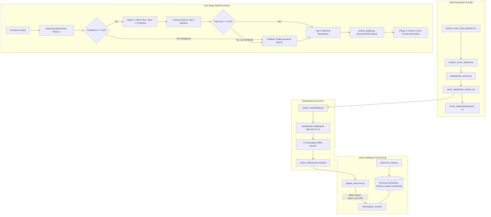

# Production Vector Retrieval Architecture (Pinecone RAG)

This document details the production architecture for the **Retrieval-Augmented Generation (RAG)** knowledge layer of the Hiver AI Customer Support Agent.

---

## 1. Why Vector Search is Required

Customer support inquiries exhibit high lexical variance:
- *"My parcel has not arrived"*
- *"Where is my package?"*
- *"Tracking says delivered but nothing is at my door"*
- *"Mera order deliver nahi hua abhi tak"* (Hinglish)
- *"Mi paquete no ha llegado todavía"* (Spanish)

Keyword search (BM25) fails when user wording diverges from historical text or when queries are non-English. Vector search projects semantic meaning into a continuous 384-dimensional hypersphere, enabling our system to retrieve verified official Amazon resolutions for semantically identical problems regardless of phrased vocabulary or source language.

---

## 2. Production Architecture & Ingestion Flow



---

## 3. Embedding Lifecycle & Versioning

- **Encoder Model**: `paraphrase-multilingual-MiniLM-L12-v2`
- **Output Dimension**: 384 floats
- **Metric**: Cosine similarity via L2 unit sphere normalization ($\|v\|_2 = 1.0$)
- **Versioning Strategy** ([vector_data/metadata.json](file:///d:/PROGRAMMING/hiver-assignment/vector_data/metadata.json)):
  ```json
  {
    "embedding_model": "paraphrase-multilingual-MiniLM-L12-v2",
    "dimension": 384,
    "metric": "cosine",
    "dataset": "amazon_final_intent_dataset",
    "dataset_size": 52124,
    "version": "v1",
    "namespace": "amazon"
  }
  ```
  *Rationale*: If the embedding model is upgraded in the future (e.g. to a larger 768d model), the version tag prevents vector space collisions.

---

## 4. Multi-Tenant Namespace Strategy

We do not store vectors in Pinecone's default namespace. Instead, we use dedicated namespaces:

| Tenant / Brand | Pinecone Namespace | Status |
| :--- | :--- | :--- |
| **Amazon** | `amazon` | Active (TWCS Support Corpus) |
| *Apple* | `apple` | Future expansion |
| *Uber* | `uber` | Future expansion |
| *Spotify* | `spotify` | Future expansion |

This allows multi-brand isolation within a single Pinecone Serverless index without operational fragmentation.

---

## 5. Two-Stage Hybrid Retrieval Workflow

Retrieval executes in two distinct stages:

### Stage 1: Fast Intent Classification
The incoming query is classified by the Phase 1 Logistic Regression classifier to produce:
- `predicted_intent` (e.g., `DELIVERY_DELAY`)
- `confidence` (e.g., `0.98`)

### Stage 2: Intent-Filtered Vector Search
Pinecone is queried within namespace `"amazon"` using a metadata filter:
```json
{
  "filter": {
    "intent": {"$eq": "DELIVERY_DELAY"}
  }
}
```
This hard constraint prevents cross-intent contamination (e.g. never returning an Account Access password reset link when a customer asks about a delayed package).

### Fallback Mechanism
If the top similarity score is below `0.60` (or if intent classification confidence is < 0.40), the pipeline automatically removes the intent filter and executes a **global semantic search** across all historical cases. This guarantees that edge cases and rare phrasing still receive relevant context.

---

## 6. Context Builder for Gemini RAG

Raw Pinecone JSON responses are structured by [`backend/services/context_builder.py`](file:///d:/PROGRAMMING/hiver-assignment/backend/services/context_builder.py) into prompt-ready context:

```markdown
### HISTORICAL SUPPORT RESOLUTIONS CONTEXT
Verified Intent: DELIVERY_DELAY
Relevant Historical Cases Retrieved: 2

--- Historical Example 1 (Relevance Score: 0.92, Intent: DELIVERY_DELAY) ---
Customer Inquiry: "Where is my package? It is 2 days late."
Amazon Official Resolution: "We're sorry for the delay. Tracking shows transit weather delays. Please check carrier tracking at amazon.com/orders."

### INSTRUCTIONS FOR RESPONSE GENERATION:
- Adopt the helpful, professional, and empathetic tone of the historical Amazon resolutions above.
- Provide direct, actionable next steps based on the verified intent.
```

---

## 7. Production Observability & Privacy

Every retrieval request logs structured telemetry:
- `request_id`: Unique tracking UUID
- `predicted_intent`: Canonical intent label
- `top_similarity_score`: Cosine similarity float
- `number_of_results`: Count of returned matches
- `fallback_used`: Boolean indicator of global search fallback
- `latency_ms`: Execution time in milliseconds

**Privacy & PII Protection**: Customer account numbers, email addresses, and phone numbers are scrubbed during preprocessing and are never stored in telemetry logs.

---

## 8. Failure Handling & Degradation

| Failure Mode | Detection | System Behavior |
| :--- | :--- | :--- |
| **Pinecone Unavailable** | Connection / DNS / Timeout Error | Returns `{"retrieval_status": "unavailable", "results": []}`. The downstream agent falls back to zero-shot Gemini response generation. |
| **No Similar Match** | Empty query or score < 0.40 | Returns `{"retrieval_status": "no_match", "results": []}`. |
| **Low Confidence Intent** | Confidence < 0.40 | Automatically skips the intent filter and runs global similarity search. |

---

## 9. Evaluation Methodology

The retrieval pipeline is evaluated using [`scripts/evaluation/evaluate_retrieval.py`](file:///d:/PROGRAMMING/hiver-assignment/scripts/evaluation/evaluate_retrieval.py):
- **Recall@K**: Percentage of retrieved top-$K$ cases matching the target intent.
- **Top-1 Intent Accuracy**: Alignment between top retrieved record and gold-standard category.
- **Mean Similarity Score**: Average cosine similarity of top results.
- **Query Latency**: End-to-end latency budget (<150ms).
